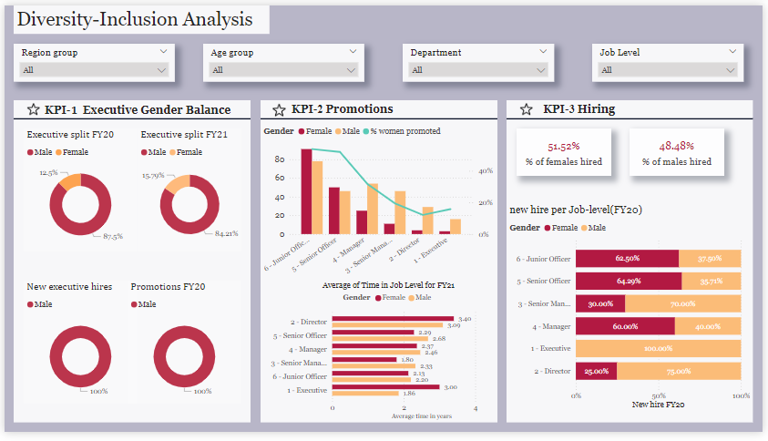
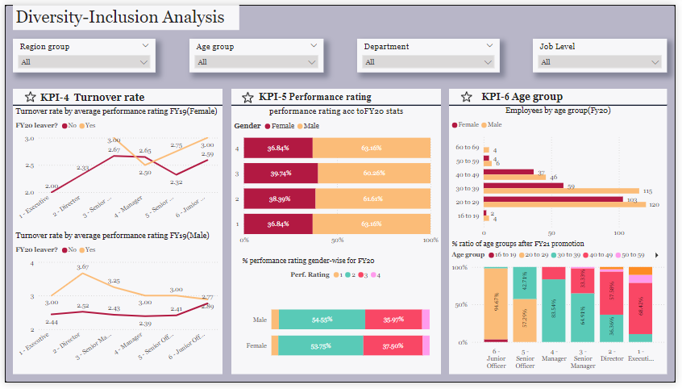

# **PowerBI-Diversity-Inclusion-analysis**

## **Objective:**

The objective of this case study is to analyze the current gender distribution, and provide actionable insights to enhance executive gender balance .

## **Tool Used:**

PowerBI Desktop

## **DataSet:**

The dataset was provided in the form of an excel sheet which contained the customer data about:

- employee demographics (EmployeeId,gender,age)
- employment details (job level,employment type,department)
- career progression (promotion status, years with company)
- performance (performance rating FY19 and FY20)
- hiring (new hire, last hire date)
- turnover (leaver FY20) 

## **Dashboard Overview:**

## **Overall analysis view:**

The analysis gives a breif overview of the factors responsible for the churning of customers. The Power BI dashboard provides visualizations and identifiest these 6 key performance indicators(KPIs):

- **Executive Gender balance**: A slight increase was noticed in the proportion of female executives from FY20 to FY21. Neither females were hired nor promoted for the post of executive in FY20 creating gender imbalance.
- **Promotions**: Women generally have lower promotion rates and take longer to be promoted compared to their male counterparts. 
- **Hiring**: There is a higher percentage of female hires at lower job levels (Junior and Senior Officer), but this reduces at higher job levels (Senior Manager and above).
- **Turnover**:Turnover rate is higher for females than for males. 
- **Performance rating**: according to FY20 performace rating reports both the genders have similar ratings.
- **Age group**: majority of the employees working there falls in the age group 20-29 of young beginning at Junior Officer level.

